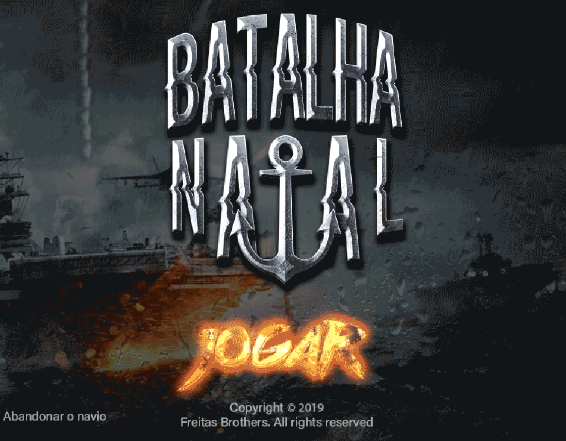
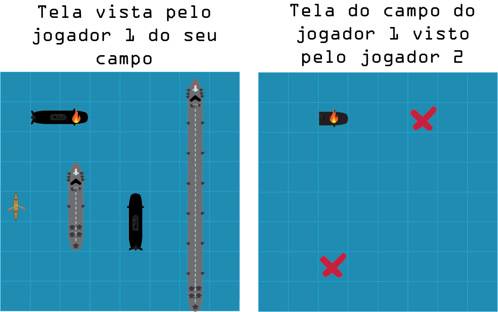
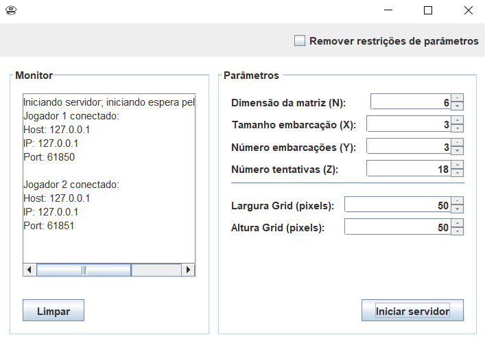
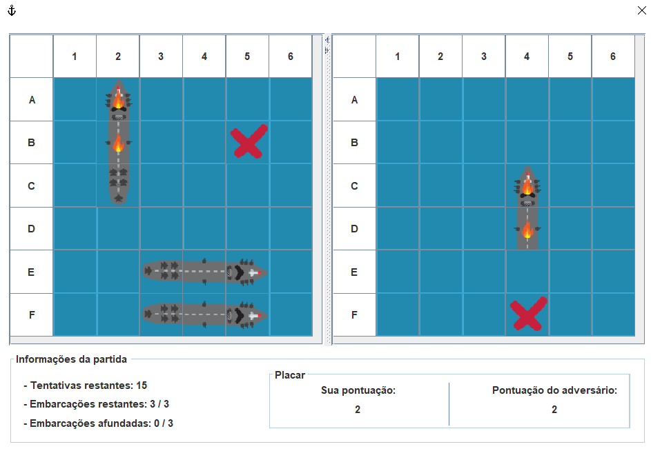

# Battleship Game - Using Sockets



A Battleship game developed in 2019 using Java and sockets that can be played by two players.
This game was proposed in a college assignment of the subject Networks. The description (portuguese only) of this assignment can be found [here](description-tp2sockets2019.pdf).

**Restriction of this assignment**: do not use different threads, i.e., one player will have the UI blocked when the other player is making his move.

**Requirements:**
- Java 8 or newer versions

# Concept

The players can see both players' boards that are updated after each move:
- the left board is the player's board and is revealed;
- the board on the right is the opponent's board and is not revelead at the start, but each square is revealed after a shot is fired at it.

The figure below shows an example of this concept, and involves 3 types of vessels: canoe, submarine and warship.



# Running the Battleship Server

Go to the directory **./"Client and Server Projects"/ServidorBatalhaNaval/** and execute the following commands in the terminal to compile and execute, respectively:

```
javac -encoding UTF8 -cp . src/servidorbatalhanaval/*.java -d src/build

java -cp "src/build;src" servidorbatalhanaval.ServidorBatalhaNaval
```

- Configuration screen:

    - N: Game table size (NxN)
    - X: Ship size
    - Y: Number of ships
    - Z: Number of moves a player can make
    - "Largura Grid": Grid width
    - "Altura Grid": Grid height



# Running the Battleship Client

Go to the directory **./"Client and Server Projects"/BatalhaNaval/** and execute the following commands in the terminal to compile and execute, respectively:
```
javac -d src/build -encoding UTF8 -cp "lib/batik-bin-1.11/batik-1.11/lib/batik-all-1.11.jar;lib/batik-bin-1.11/batik-1.11/lib/xml-apis-ext-1.3.04.jar;lib/batik-bin-1.11/batik-1.11/lib/xmlgraphics-commons-2.3.jar;." src/batalhanaval/*.java src/batalhanaval/utils/*.java

java -cp "lib/batik-bin-1.11/batik-1.11/lib/batik-all-1.11.jar;src/build;lib/batik-bin-1.11/batik-1.11/lib/xml-apis-ext-1.3.04.jar;lib/batik-bin-1.11/batik-1.11/lib/xmlgraphics-commons-2.3.jar;src" batalhanaval.BatalhaNaval
```
After starting the client, press the button "JOGAR" if the server is online. Then it'll wait for a second player to join and start the game. Therefore, you need to execute three different process to play the game: two clients and the server.

- Playing:



Copyright © 2021 Daniel Freitas Martins (dnlfm) and Matheus Freitas Martins (mtsfreitas)
